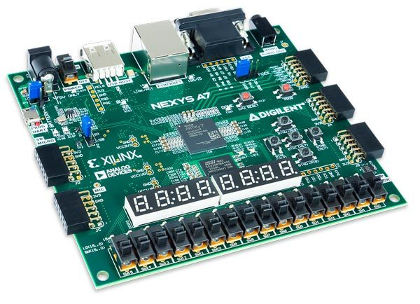

# lab 1

*I pledge my honor that I have abided by the Stevens Honor System* - Joshua Schmidt

## part 1 - seven-segment decoder

The purpose of this lab was to show how to use the Nexys A7 fpga board, programmed with Xilinx Vivado 2019.2, using the sample code for a seven segment display as a starting point for the lab. The goal is to learn how to use Vivado and program the fpga, so that the sample program can be modified to perform a new task.

FPGA stands for field programmable gate array, and is an integrated circuit designed to be configured and designed after production. It is essentially a programmable circuit with digital logic. The Nexys A7 connects to a computer through usb, so that the fpga can be flashed and reprogrammed.

In this lab, the goal is to control the on-board seven segment displays and get input from the corresponding switches. In order to control the displays, the programmer needs to link the underlying system architecture in VHDL to the circuit components on the actual board. The reference manual provides the information necessary to do this.

This circuit diagram shows the switches and their corresponding port numbers, as well as each of the seven segment displays and the logic bus to control the LEDs. Each seven segment display has seven individual segments or lines that can be either high or low, to create the letters and numbers that are specified in the program. CA through CG correspond to D18, F18, L18 as shown in the circuit diagram above. This correlation will be used in the vhdl program to create the specification we want. The final DP line is used to make the display have a set brightness and illumination.

The manual states that in order for the digits to stay bright, they should be refreshed at least every 16 ms. This allows for all of the digits to appear as though they are on at the same time, even though they are actually turning on and off sequentially. This illumination is directly controlled by the mapping of ports to variables in the VHDL code. The variable dig is a 2 digit binary number, mapped to R17 and T18 in the fpga constraints file. It maps to two switches that choose which digit is illuminated, specifying the anode in a switch statement. The data variable is a 4 digit binary number mapped to H18, K17, K18 and G18, and by definition to the far right switches. These switches are used to select what digits are being displayed at any given time.

The segments of the display are mapped to a common anode, as shown in the circuit diagram above. The variable anode is used to toggle this common anode, so when the anode is high and the cathode is low, the section is illuminated. Because the anode is written in big-endian, the first digit referenced in the code is 1110, or a zero. The segment variable is used to hold what data is being sent to the display, so the correct segments are illuminated at any given time.

The code for this first lab project can be viewed on the [github here](https://github.com/jschmidtnj/cpe487)

## project 2 - hex counter

In this second project in the lab, the LED decoder file is used from the last project, but with the addition of a counter file. The counter is created with a clk input mapped to the E3 port, which is a 100 MHz crystal oscillator on the Nexys A7 board. This clock is set to 50MHz for this project so that the rising and falling edge can easily be seen by the board - 100 MHz speed is not required.

In the program, the cnt variable is set to increment on the rising edge of the clock. This functionality is accomplished by specifying the clk event and that the least significant bit in the clock needs to be equal to 1 to trigger the event, or at every positive value.

The clock running at 50MHz will update the count every 1.45 Hz, because it is dependent on whenever the 25th bit changes. So it does not change every second as I once thought. This 1.45 Hz corresponds to 0.67 seconds.

Every time the clock changes, the numbers also change, counting up to 9. The code for this second part of the lab can also be found in the same repo, under `code/labs/lab1/lab1.srcs/sources_1/new/`
